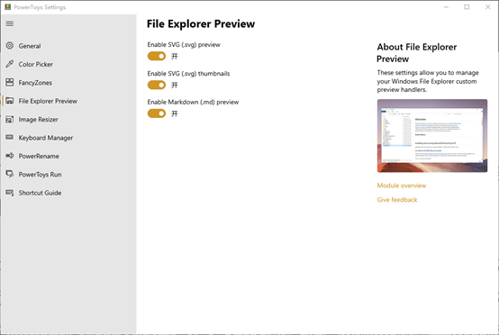
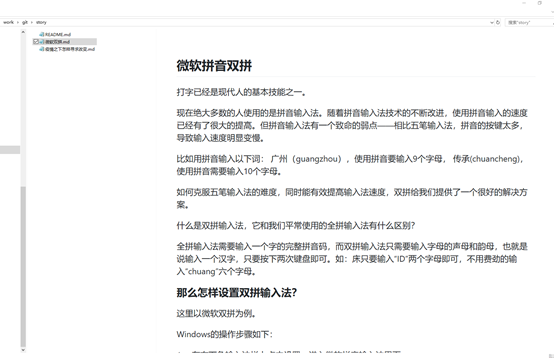
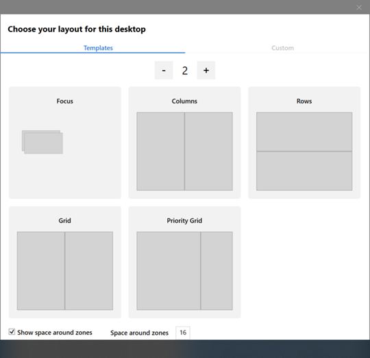
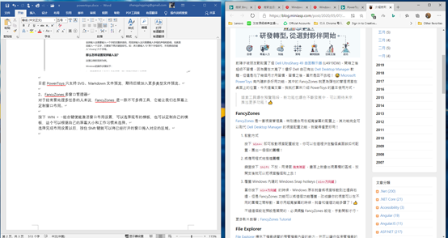
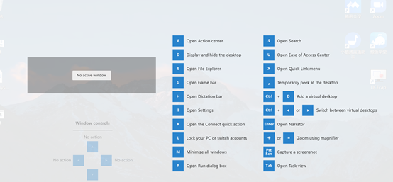
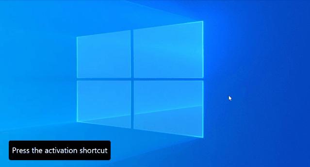

Win10官方外挂，这四个功能你值得拥有

 

早期的windows由于缺少图形化界面，很多参数的设置都需要通过修改注册表来完成。因而在windows95时代启动了效率工具箱PowerToys，这套工具以图形化提供定制选项，可惜后来由于功能不稳定、测试不严格而被停止。

时隔20年，微软在今年5月重启并在github上开源了这个项目，使得PowerToys得到了重生。

PowerToys这个项目目前还没有内置在windows里面，可以通过https://github.com/microsoft/PowerToys/releases/下载。

 **1、 SVG图片和Markdown预览**

虽然Windows资源管理器针对一些常见文件类型提供了预览，比如JPG、PNG图片格式，但对于经常要和SVG、Markdown文件打交道的人来说，我们依然无法通过资源管理器查看这两种文件的预览效果，设计师和文字工作者只能使用特定文件打开这两种文件才能一睹真容，未免有点麻烦。

如果正好你也需要与这两种文件打交道，下载安装PowerToy在资源管理器中勾选SVG Previewer和Markdown Previewer。重启资源管理器后便可以开启SVG图片和Markdown图片预览了。

目前PowerToys只支持SVG、Markdown文件预览，期待后续加入更多类型文件预览。

 **2、 FancyZones多窗口管理器**

对于经常要处理多任务的人来说，FancyZones是一款不可多得工具，它能让我们在屏幕上定制窗口布局。

按下WIN + ~组合键便能激活窗口布局设置，可以选择现有的模板，也可以定制自己的模板，你可以根据自己的屏幕大小和工作习惯来选择。

选择完成布局设置以后，按住Shift键就可以将已经打开的窗口拖入对应的区域。

**3、 快捷键辅助工具**

要在Windows10上高效的工作，熟练使用的快捷键是一个非常有帮助的技巧，但繁多的快捷键经常容易忘记，临时查看又可能会浪费很多时间。Windows key shortcut guide这个辅助工具帮助我们解决了这个问题，让我们随时都可以查看快捷键的操作指南。

具体操作非常简单，长按WIN键一秒钟就可以激活全屏显示的快捷键指南。

**4、 取色工具**

取色工具虽然很多，比如我现在使用的snipaste截图的时候就可以进行取色，但毕竟是第三方的工具，需要自己独立安装。PowerToys目前已经加入了Color Picker，可以非常方便的进行取色。

在键盘上按下WIN + SHIFT + C快捷键后，就会出现取色坐标，移动鼠标找到需要取色的位置，鼠标点击左键就可以将取到的色彩数值拷贝到剪贴板中。

值得一提的是，为了方便对一些细致的取色场景，PowerToys取色工具可以使用滚动操作对特定区域进行放大。

以上是我给大家推荐的四个常用工具，随着PowerToys不断更新，相信未来会有更多实用功能加入进来，让我们共同期待吧！

 